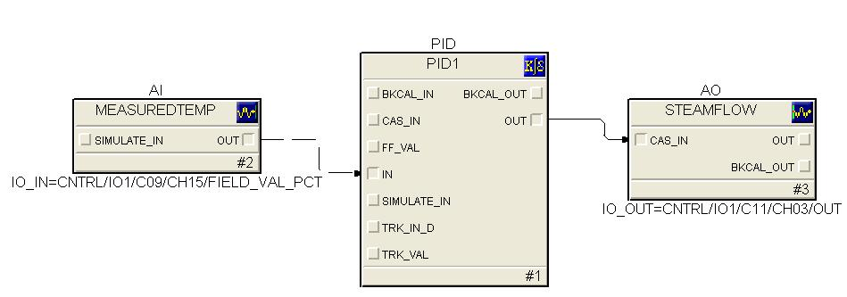

### The procedure for using simulator is as follows:
Using PID function block the outlet water temperature is to be maintained as mentioned under Theory tab.
The input to PID block is Measured variable and the Set point is desired value of the temperature. The manipulated variable is steam flow rate. The implementation is shown here.

As per the changes in the process temperature and the settings of P action, D action and I action, the output of the PID block is calculated and the steam valve opening is varied to maintain the water temperature.
The values for proportional gain, integral time and derivative time are adujsted to optimize process performance.
Make use of simulator to implement the logic. Double click on PID block to set its properties.

