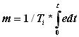
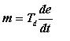
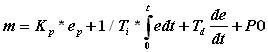
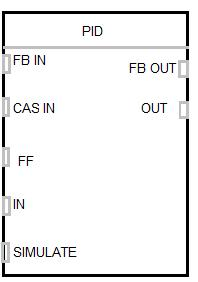
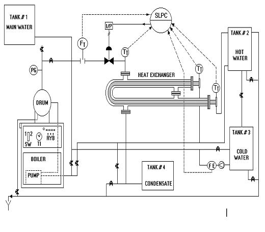
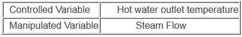
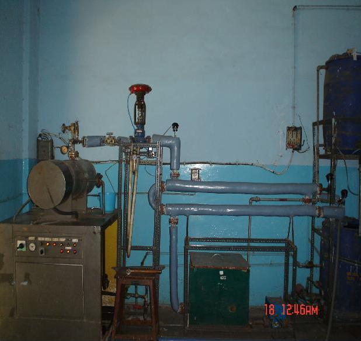

Distributed control systems are used for controlling plants which are physically as well as functionally distributed. This control system is preferred when number of analog control loops to be controlled is more than discrete control. One of the analog schemes used as basic control strategy is PID control. The theory behind PID control is discussed here.

### **On-Off Control: Discrete Control**
As the name suggests this strategy is preferred for on - off type applications. This is a simplest form of control. Chattering of contacts for final control element is major problem but it can be avoided by addition of dead zone. Precise control is not possible due to addition of dead zone.
Mostly all domestic applications as Water Geyser, Electric iron, Electric Ovens are controlled using on-off control strategy.

### **PID: Continuous Control**
There are 3 basic actions in PID.
* Proportional
* Integral
* Derivative

Proportional mode: - In this mode the controller output varies linearly with respect to the error.
The equation for P mode is
m = Kp * e + Po

Where,
m is the controller output. \
Kp is the gain of controller \
e is the error in % \
Po is the proportional Bias. (Value of m at e =0) \
Due to addition of proportional bias, positive as well as negative errors are handled. Generally Po is set at 50% to handle equal positive and negative error range. Higher is the gain lower is the band to control.

**Integral mode: -** Integral mode is used to remove the offset produced due to P mode. Offset can either be positive and negative. Equation for Integral mode is

Where,
Ti is the integral time setting and t is the time.
When this action is used alone due to integral effect the action becomes too slow. When combined with Proportional, the action may go into saturation which is called as Reset Windup. To overcome this, controller output is limited at lower and higher end. This is called as Anti reset windup. But due to addition of Integral action Offset is nullified.

**Derivative mode:-** This action is used to increase the speed of response of slow processes. It anticipates the rate of change of error and takes the control action.
Equation for Derivative mode is

Where,
Td is the derivative time .

Set Point can be achieved quickly by using D mode. In noisy environment. this action is not used as the output goes into saturated
condition. Even for constant error D action provides no correction, hence not preferred alone. It is always combined with P action.
Composite controller, i.e. P, I and D adds advantages of all the three modes.
The Equation for the combined controller is

Loop tuning time can be optimized by using proper combination of PB, Ti and Td
One of the analog control functions available in DCS is 'PID'. Let us look at various configurable parameters available for this block.

The process parameter analog value (PV) is given as input to the block at IN terminal. The remote analog set point is provided to CAS IN terminal in case of Cascade Control. In case of feedforward control input is given to FF terminal. In case of manual mode, input value is given to SIMULATE terminal. For auto/manual bumpless transfer or to avoid rest windup, the FB OUT is connected back to FB IN of the same or another block. This keeps the track of changes made in manual mode and adjusts the controller output prior to the control mode is changed from manual to auto.
Let us see how PID function is used for controlling heat exchanger.
The piping and Instrument diagram for the heat exchanger with a boiler unit along with system details are shown here.

This pipe in pipe type heat exchanger uses the steam produced by an electrically fired boiler which raises water temperature. The feed water pump for boiler is mounted on the base frame of the unit and pumps water into the boiler. To avoid scale formation and to reduce maintenance treated water is used. Heat released by operating heaters is utilized for heating water in the shell. Insulation of shell is done with glass wool to prevent heat losses. The steam pressure is controlled by means of a pressure switch at 4.5 Kg/cm2. PT-100 sensors used monitor the temperature at the inlet and outlet . The inlet water flow is measured with a magnetic flow, while the steam pressure is monitored using HART (Highway Addressable Remote Transducer) based pressure transmitter. The objective is to maintain water outlet temperature. The variables associated are

The photograph of the system is show below.

The Function Block Diagram as per the available Emerson Delta V DCS in College of Engineering Pune.
